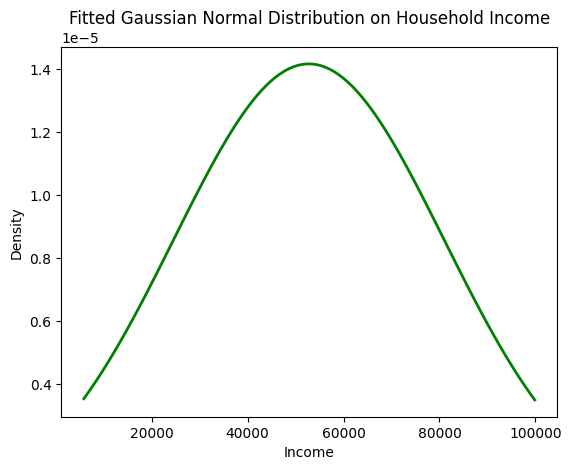
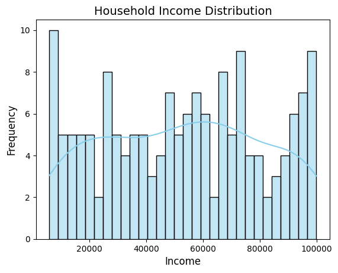
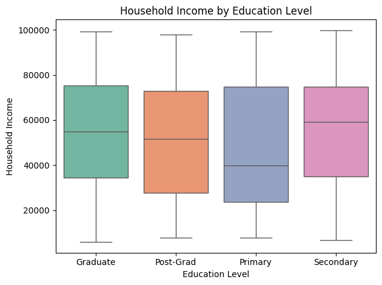
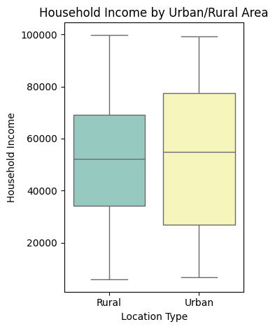

# 📊 Household Dataset Analysis

## 📌 Project Overview

- **Project Title:** Household Dataset – Exploratory Data Analysis  
- **Tools Used:** Python (Pandas, NumPy, Matplotlib, Seaborn), Jupyter Notebook  
- **Duration:** *Mention your time duration here (e.g., 5 hours)*  
- **Objective:** To perform a comprehensive statistical analysis on household data and derive key insights related to income, demographics, and ownership status.

---

## 🧰 Dataset Information

The dataset contains records of various households with the following columns:
- `Household_ID`
- `Age_of_Household_Head`
- `Household_Income`
- `Education_Level`
- `Family_Size`
- `Owns_House`
- `Urban_Rural`

---

## 📌 Key Tasks Performed

1. **Data Cleaning & Preprocessing**
   - Loaded dataset and handled missing/null values (if any).
   - Verified datatypes and data consistency.

2. **Data Categorization**
   - **Categorical:** `Education_Level`, `Owns_House`, `Urban_Rural`
   - **Numerical:** `Age_of_Household_Head`, `Household_Income`, `Family_Size`

3. **Central Tendency Measures**
   - **Household Income:**
     - Mean: `52,736.14`
     - Median: `54,002`
     - Insight: Slight left-skewed distribution (majority households earn above average)
   - **Age of Household Head:**
     - Distribution approximately normal with close mean, median, mode.

4. **Dispersion Analysis**
   - Range, Variance, Standard Deviation of income calculated.
   - Interquartile Range (IQR) used to understand income spread.

5. **Distribution & Shape**
   - Histogram + Gaussian curve to check normality.
   - **Skewness** & **Kurtosis** assessed for income distribution.

   
   
---

   

6. **Visual Explorations**
   - Bar plots, boxplots, correlation heatmaps.
   - Insights into education vs income, ownership by area, etc.

   

---

   

---

## 💡 Key Insights

- Majority of household heads are middle-aged.
- Income distribution is **negatively skewed**.
- Higher education correlates with higher income.
- Urban households are more likely to own homes compared to rural.

---

## ✅ Conclusion

This analysis provided a foundational understanding of how age, education, and geography impact household income and ownership patterns. The insights can guide policymakers, urban planners, or businesses targeting household demographics.
